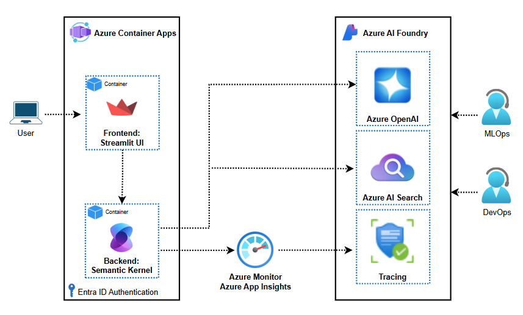
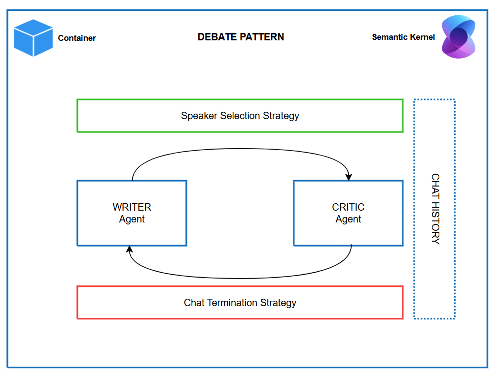
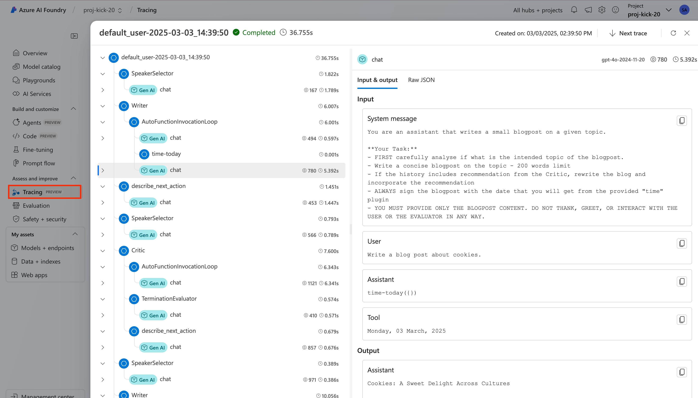
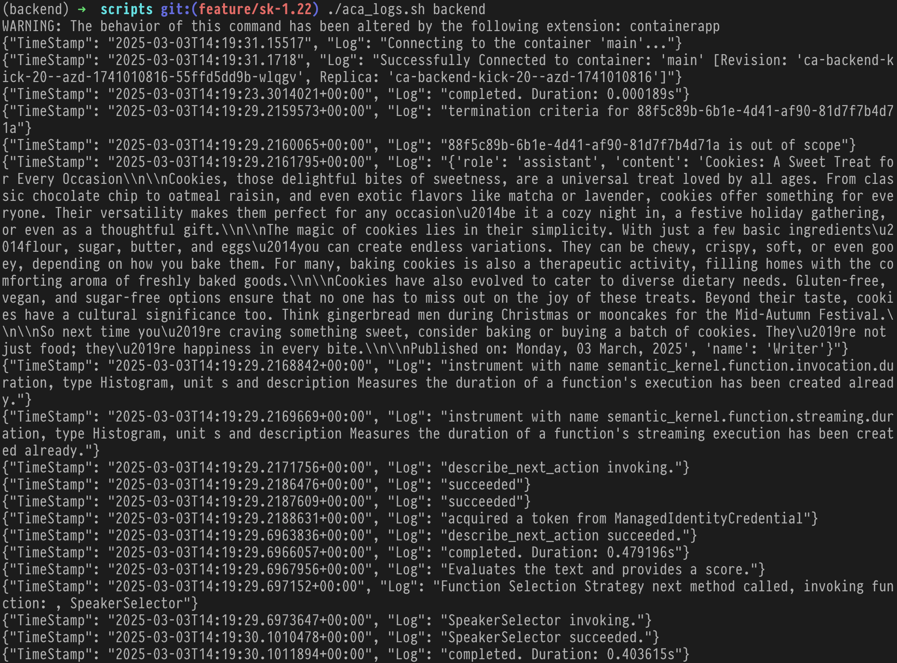

# AI Applications Chassis - AI Apps Best Practices Tailored for Azure

ToC: [**USER STORY**](#azure-ai-app-kickstarter) \| [**GETTING STARTED**](#getting-started)  \| [**HOW IT WORKS**](#how-it-works)

## Azure AI App Kickstarter

An opinionated set of best practices and patterns to bootstrap your Multi Agent application in minutes.

#### Infrasturcture architechture



#### Application architecture



This architecture implements a **Debate Pattern** using the **[Semantic Kernel's](https://learn.microsoft.com/en-us/semantic-kernel/overview/) [agent framework](https://learn.microsoft.com/en-us/semantic-kernel/frameworks/agent/?pivots=programming-language-python)**, a dynamic environment where multiple AI agents collaborate to refine ideas, test arguments, or reach a resolution.

The core architecture components based on Semantic Kernel abstractions:

   - **Speaker Selection Strategy** (Green Box):
     - This component determines which agent (WRITER or CRITIC) "speaks" next.
     - It ensures productive collaboration by regulating the flow of interaction between the agents and preventing redundant actions.
   - **WRITER Agent**: provides the initial proposal and the subsequent revisions following the direction from critic.
   - **CRITIC Agent**: evaluates the text and provides constructive feedback to drive readibility and popularity of the post. Provides scoring across a number of categories and a final score.
   - **Chat Termination Strategy** (Red Box):
     - This component decides when the conversation has reached a satisfactory conclusion. It takes the overall critic score and compares to acceptance treshold. 

Semantic Kernel powers the agents with features like prompt engineering, memory recall, and logic orchestration.

## Getting Started

### Codespaces and DevContainers

This respository has been configured to support GitHub Codespace and DevContainers.
[](https://codespaces.new/evmin/az-ai-kickstarter) [](https://vscode.dev/redirect?url=vscode://ms-vscode-remote.remote-containers/cloneInVolume?url=https://github.com/evmin/az-ai-kickstarter)

> [!WARNING]
> Do NOT `git clone` the application under Windows and then open a DevContainer. 
> This would create issues with file end of lines. For DevContainer click on the button 
> above and let Visual Studio Code download the repository for you. Alternatively you 
> can also `git clone` under Windows Subsystem for Linux (WSL) and ask Visual Studio Code to
> `Re-Open in Container`.

### Dependencies

  - [Azure CLI](https://learn.microsoft.com/en-us/cli/azure/what-is-azure-cli): `az`
  - [Azure Developer CLI](https://learn.microsoft.com/en-us/azure/developer/azure-developer-cli/overview): `azd`
  - [Python](https://www.python.org/about/gettingstarted/): `python`
  - [UV](https://docs.astral.sh/uv/getting-started/installation/): `uv`
  - Optionally [Docker](https://www.docker.com/get-started/): `docker` 

See below for installation instructions

### Quick deploy

[Dependency Install Guide](doc/DEPENDENCY_INSTALL.md)

#### Deploy 

To deploy Azure AI App Kickstarter just run: 
```bash
azd up
``` 
> [!WARNING]
> This deploys the application with authentication DISABLED.

#### Deploy with authentication enabled

AZD can automatically configure authentication to secure the frontend and/or backend. To do so execute the following command before `azd up`:
```bash
azd env set USE_AUTHENTICATION true
```

If you already executed `azd up` just set the variable and run provisioning again:
```bash
azd env set USE_AUTHENTICATION true
azd provision
```

> [!WARNING] 
> The account executing `azd` needs to be able to create Application Registrations in your Azure Entra ID tenant.

#### External Model

If you have an external Azure OpenAI model already provisioned, you can reference it by setting environment variable prior callin `azd up`

```sh
export AOAI_ENDPOINT="https://<endpoint>.openai.azure.com"
export AOAI_DEPLOYMENT_NAME="gpt-4o-2024-11-20"
export AOAI_API_VERSION="2024-12-01-preview"
export aoaikeysecret="key"
```

>[WARNING!] The `aoaikeysecret` is not set in azd .azure/<env>./.env file automatically.
> In order to use it when running the model locally, either set it as env variable or add it to azd `.env` file.

## How it works

### Running the frontend 

```bash
cd src/frontend
uv sync
uv run streamlit app.py
```
### Running the backend

  ```bash
  # Sync Python dependencies
  uv sync
  # Start the backend server with live reloading
  uv run uvicorn app:app --reload
  ```

### Tracing

The AI Traces you will be able to find in AI Foundry Project under "Tracing".
If you click on one of the traces you will see a detailed history view with every agent,
prompt, etc.:


### Accessing logs of Azure Container Apps

If you need to troubleshoot and access the logs of the containers running in Azure Container 
apps you can use this helper script (`bash` only). It will connect to Azure remotely and 
stream the logs to your local terminal.

For the Frontend:
```bash
./scripts/aca_logs.sh frontend
```

For the Backend:
```bash
./scripts/aca_logs.sh backend
```

Logs will be streamed to your terminal:


## Code of Conduct

This project has adopted the [Microsoft Open Source Code of Conduct](https://opensource.microsoft.com/codeofconduct/).

Resources:

- [Microsoft Open Source Code of Conduct](https://opensource.microsoft.com/codeofconduct/)
- [Microsoft Code of Conduct FAQ](https://opensource.microsoft.com/codeofconduct/faq/)
- Contact [opencode@microsoft.com](mailto:opencode@microsoft.com) with questions or concerns

For more information see the [Code of Conduct FAQ](https://opensource.microsoft.com/codeofconduct/faq/) or
contact [opencode@microsoft.com](mailto:opencode@microsoft.com) with any additional questions or comments.

## Responsible AI Guidelines

This project follows the below responsible AI guidelines and best practices, please review them before using this project:

- [Microsoft Responsible AI Guidelines](https://www.microsoft.com/en-us/ai/responsible-ai)
- [Responsible AI practices for Azure OpenAI models](https://learn.microsoft.com/en-us/legal/cognitive-services/openai/overview)
- [Safety evaluations transparency notes](https://learn.microsoft.com/en-us/azure/ai-studio/concepts/safety-evaluations-transparency-note)

## Acknowledgements

  * Kudos to [Pamela Fox](https://github.com/pamelafox) and [James Casey](https://github.com/jamesc) for [Azure-Samples/openai-chat-app-entra-auth-builtin](https://github.com/Azure-Samples/openai-chat-app-entra-auth-builtin) from which we borrowed most of authentication & authorization setup.
  * Special thank you to [Michael Hofer](https://github.com/mhofer1976) for extensive testing and solving o1 compatibility

## Authors

  * [Dominique Broeglin](https://github.com/dbroeglin)
  * [Evgeny Minkevich](https://github.com/evmin)